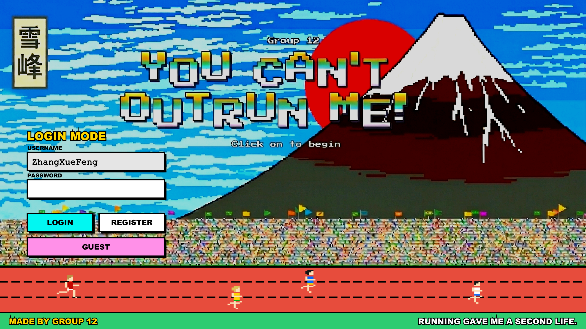
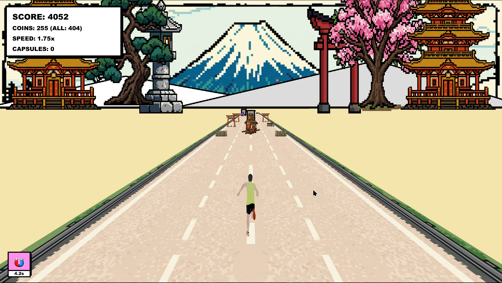
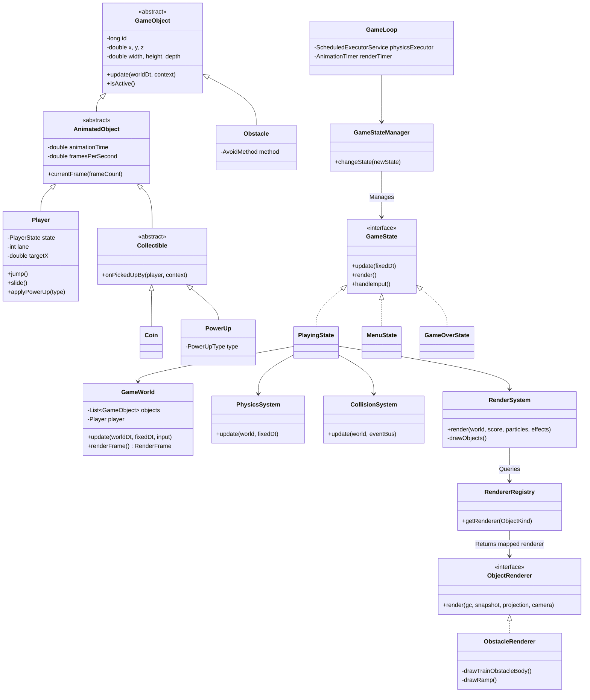

# You Can't Outrun Me! (YCOM)

An endless 3D perspective runner game built entirely in JavaFX. Experience high-speed dodging, collecting, and survival in a dynamically generated 3D world with a unique Ukiyo-e aesthetic!

## Gameplay Overview

**"You Can't Outrun Me!"** is a fast-paced infinite runner where players must navigate a continuously generating 3-lane track.

- **Dodge & Survive**: Swipe or use keyboard controls to switch lanes, jump over barricades, and slide under high containers.
- **Dynamic Speed**: The game speed progressively increases, testing your reflexes to the absolute limit.
- **Power-Ups**: Collect magnets, energy drinks (sprint/invincibility), score multipliers, and revival capsules to maximize your high score.
- **Optimized Rendering**: The game features a custom-built 3D projection engine running efficiently on the JavaFX Canvas, utilizing multi-threaded computing (parallel streams) and hardware-accelerated drawing pipelines.

### Screenshots

**Home Menu**


**Gameplay Action**


---

## Project Directory Structure

The project follows a standard Maven directory layout. The codebase is modularized based on a hybrid OOP and ECS (Entity-Component-System) architectural pattern to ensure high performance and maintainability.

```text
YCOM/
├── src/
│   └── main/
│       ├── java/
│       │   └── com/ycom/
│       │       ├── app/         # Application entry point and multi-threaded GameLoop
│       │       ├── core/        # Game configurations and Time management
│       │       ├── entity/      # Core game objects (Player, Coin, Obstacle, PowerUp)
│       │       ├── event/       # EventBus for decoupled cross-system communication
│       │       ├── render/      # 3D projection math, Cameras, and custom ObjectRenderers
│       │       ├── resource/    # AssetManager & AudioManager for textures and SFX
│       │       ├── state/       # Game state machine (Menu, Playing, GameOver, Shopping)
│       │       ├── system/      # Logic Systems (Physics, Render, Collision, Input, Spawner)
│       │       └── world/       # GameWorld state container holding active entities
│       └── resources/
│           └── assets/          # Static assets (packaged into the final executable Jar)
│               ├── audio/       # BGM and SFX (.wav, .mp3)
│               └── textures/    # UI and 3D object textures (.png, .jpg)
│                   └── runners/ # Sprite sheets for character running animations
├── pom.xml                      # Maven build configuration and dependencies
└── README.md                    # Project documentation
```

---

## Architecture & Class Inheritance

The game architecture strictly separates **State**, **Logic**, and **Rendering**.

- The physical world updates on a fixed-timestep background thread (`ycom-physics`).
- The 3D graphics projection and rendering are parallelized and drawn on the `JavaFX Application Thread`.
- Entities extend a common abstract `GameObject`.
- Rendering uses the Visitor/Strategy pattern via `RendererRegistry` and `ObjectRenderer`.



### Key Technical Highlights

- **Decoupled Render Pipeline**: The physical logic produces `RenderSnapshot` arrays which are safely passed across thread boundaries and interpolated dynamically to match high-refresh-rate monitors.

- **Massive Parallelism**: Java 8 `parallelStream` is leveraged to calculate hundreds of 3D-to-2D matrix projections, depth-sorting, and frustum culling concurrently across multiple CPU cores before hitting the GPU.
- **Smart Garbage Collection Avoidance**: Sub-systems aggressively reuse bounding boxes and buffer lists to avoid Eden-space GC spikes during intense gameplay.
